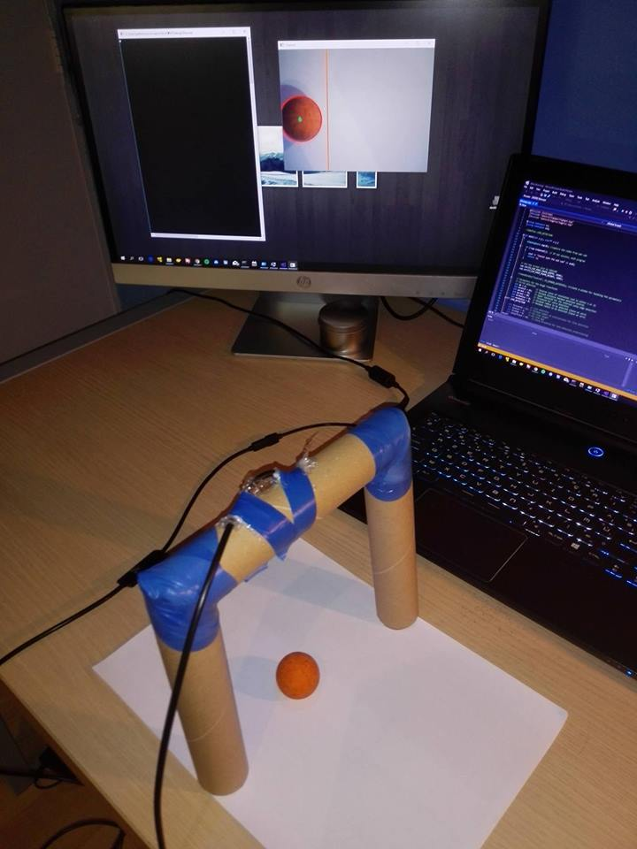
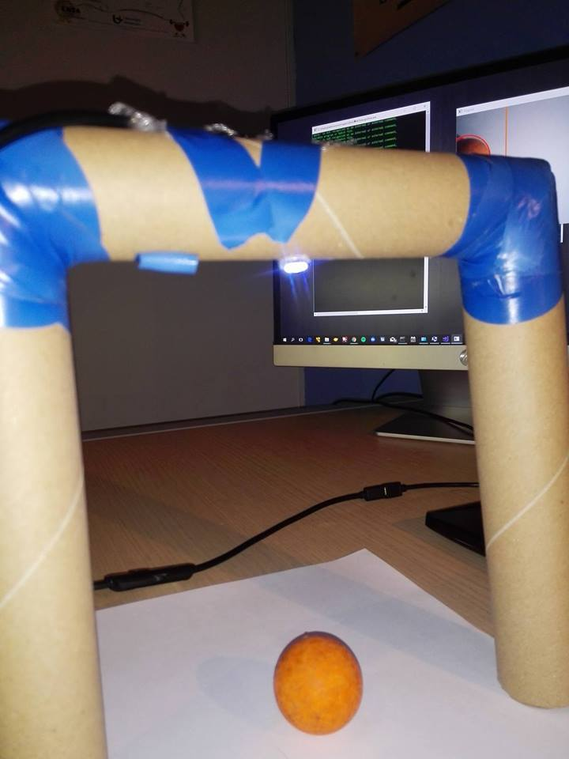
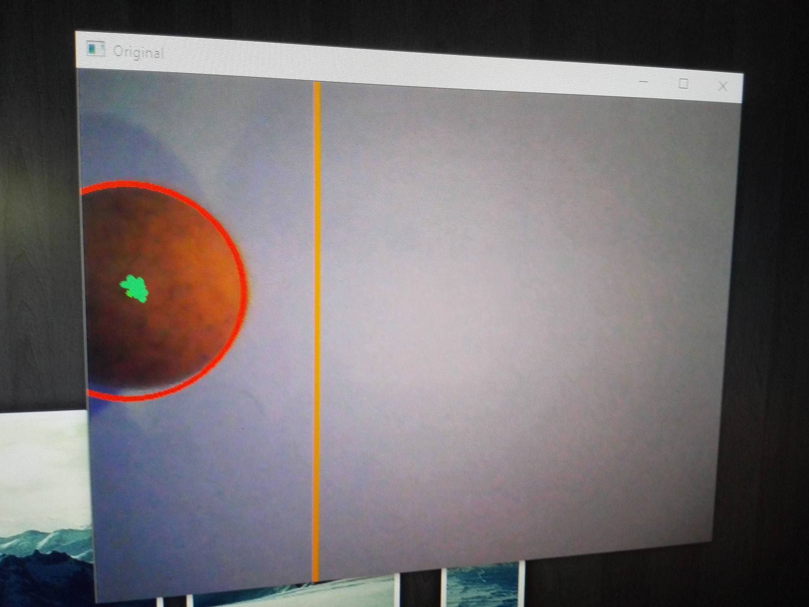

# Proof of concept

#### Web Research - Proof Of Concept.

---

## 21/11/2017
- Goedkeuring van onderwerp
- Instalatie van Kinect

## 3/12/2017
- Aanmaken van Repository

## 5/12/2017
- OpenCv
  - https://docs.opencv.org/2.4/modules/imgproc/doc/feature_detection.html?highlight=houghcircles#houghcircles
  - https://www.youtube.com/watch?v=UjXu1kqfK-A
  - https://opencv.org/
  - https://www.pyimagesearch.com/2015/02/23/install-opencv-and-python-on-your-raspberry-pi-2-and-b/

- Kinect
  - http://www.instructables.com/id/How-to-Connect-a-Kinect/
  - http://www.i-programmer.info/programming/hardware/1905-getting-started-pc-kinect.html

## 19/12/2017
- Opencv installeren op raspberry pi
- Camera proberen te installeren
- Code onderzoeken en aanpasssen
- Onderzoeken hoe opencv juist werkt
- Mogelijkheden en toeppassingen
- Bronnen
  - https://milq.github.io/install-opencv-ubuntu-debian/
  - http://www.roedan.com/goal-line-technology/
  - https://www.youtube.com/watch?v=ZcV1Y0tj-Ww
## 20/12/2017
- Fouten bij het runnen van het programma
- Zoeken naar alternatieven
  - https://www.youtube.com/watch?v=dqbhPcef7Do
  - https://cloud.google.com/video-intelligence/
## 10/01/2018
- Volgen van tutorial ->  https://github.com/MicrocontrollersAndMore/OpenCV_3_Windows_10_Installation_Tutorial
- Installatie van Visual studio 2017 Community Edition
- Open CV installeren in visual studio
## 11/01/2018
- Project aanmaken in C++ en test programma proberen runnen
- Bij het runnen van de code krijg ik de melding dat hij de open CV lib niet kan terug vinden ondanks ik deze geconfigureerd heb
## 12/01/2018
- Bin directory Toevoegen aan System PATH
- Nieuw project aanmaken in Visual studio
-  Toen Mijn testcode niet werkte had ik eerst nog mijn include directories moeten toevoegen en mijn library directory definiëren
- Vervolgens moest ik ook nog mijn opencv debug lib toevoegen aan Visual studio
- Nog altijd heb ik een fout dat hij mijn opencv debug lib niet kan vinden
- Door dat ik aan het debuggen was op x86 ipv x62 kon ik mijn programma niet runnen
- Bij het testen had ik een aantal problemen met mijn camera. Maar dit heb ik opgelost door de juiste drivers te installeren
- Objectherkenning werkt perfect en het detecteren van de positie tegenover een lijn ook
- Ik heb dit uitgetest met het maken van een miniatuur doel en daaraan een camera bevestigd

## 14/01/2018
- Testen en proberen te verbeteren 
- Geluid toegevoegd
- Afstand beter afstellen 
- Font aanpassing
